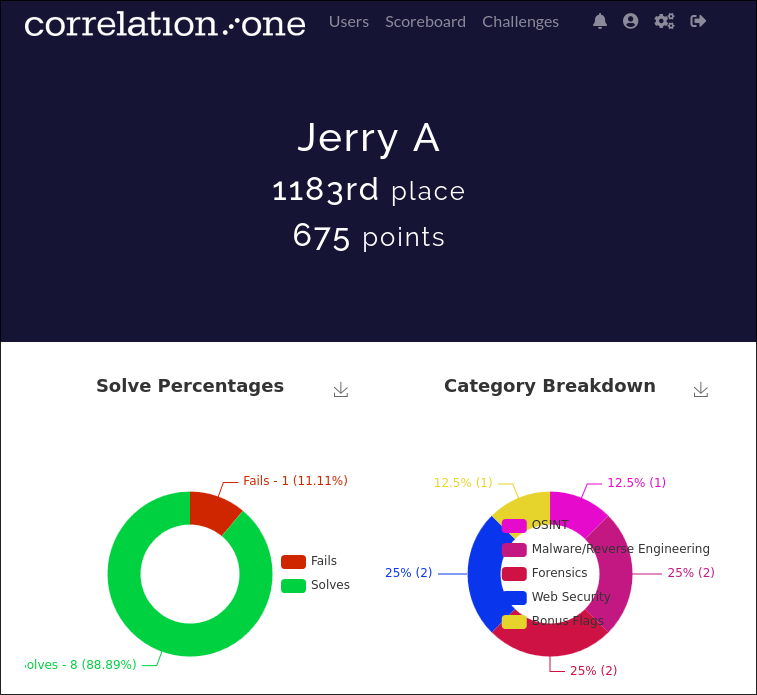
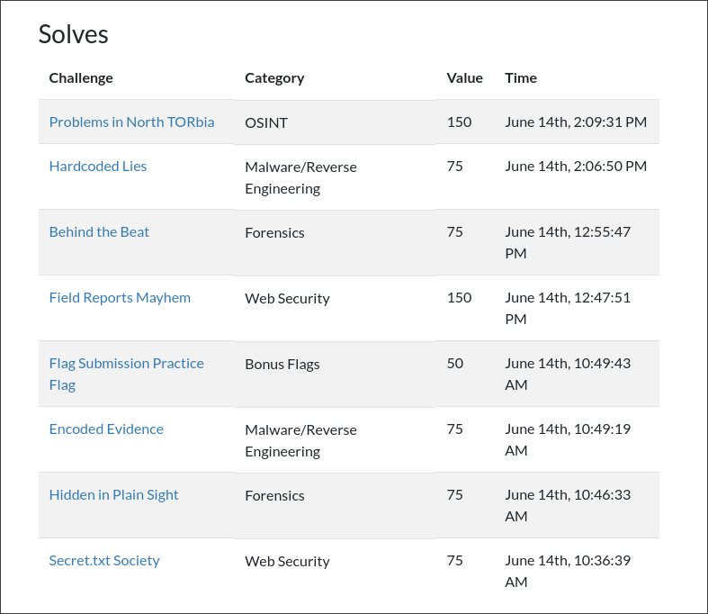

[Correlation One](https://www.correlation-one.com/dod-cyber-sentinel) is a Cybersecurity event sponsored by the U.S. Department of Defense. It had a platform for networking with peers as well as a Capture-the-flag event that can be solved by beginners and advanced hackers alike.

# Capture the Flag
The CTF event was live for two days. It had many challenges of varying difficulty that tested our knowledge in reverse engineering, networking, AI, and others. Because my experience with CTFs is still limited, I was only able to solve a handful. As a result, I placed 1183rd place as I scored 675 points.

# Writeups
* [Encoded Evidence](encoded-evidence.md)
* [Hardcoded Lies](hardcoded-lies.md)
* [Problems in North Torbia](problems-north-torbia.md)
* [Secret.txt Society](secret.txt-society.md)
