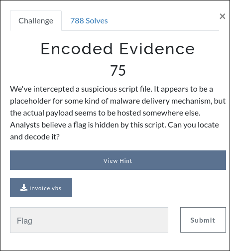

# Description
This is a reverse engineering challenge. Below is the screenshot of the challenge description.



```vbs
' Simulated Malware Sample - invoice.vbs
' This script is for CTF and learning, there is no actual malware

Dim objXML, objShell, url, response
Set objXML = CreateObject("MSXML2.XMLHTTP")
Set objShell = CreateObject("WScript.Shell")

' Should return b64
url = "https://pastebin.com/raw/eqkzMd2M"

' Retrieve the content
objXML.Open "GET", url, False
objXML.Send
response = objXML.responseText

' Display the fetched content with a security reminder
MsgBox response & vbCrLf & vbCrLf & "You really shouldn't just double-click to open scripts you download from the Internet :(", _
       vbOKOnly + vbExclamation, "Warning"
```


# Writeup
There is a Pastebin link found at line 9 within the script. The script also tells us that it contains a base64-encoded string. Access it using a browser, then do a base64 decode to get the flag. Alternatively, you can also do this all in a terminal.

```
curl https://pastebin.com/raw/eqkzMd2M | base64 -d
```
