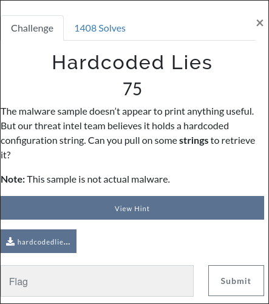

# Description
This is a reverse engineering challenge. Below is the challenge description and the file:




# Writeup
The challenge description tells us to "pull some `strings`". Lets see what happens when we do:

```
$ strings hardcodedlies
__PAGEZERO
__TEXT
__text
__TEXT
__stubs
__TEXT
__cstring
__TEXT
__unwind_info
__TEXT
__DATA_CONST
__got
__DATA_CONST
__LINKEDIT
/usr/lib/dyld
/usr/lib/libSystem.B.dylib
Initializing network interface...
C1{h4rdc0ded_but_0verlooked}
_printf
__mh_execute_header
__mh_execute_header
_printf
radr://5614542
hardcodedlies
```

This is fairly easy, but also easy to miss if you've never heard of the `strings` utility. This is usually the first thing I run whenever I encounter reverse engineering challenges involving binary executables. They either give me the flag, a base64-encoded version of it, or an idea on what it does.
