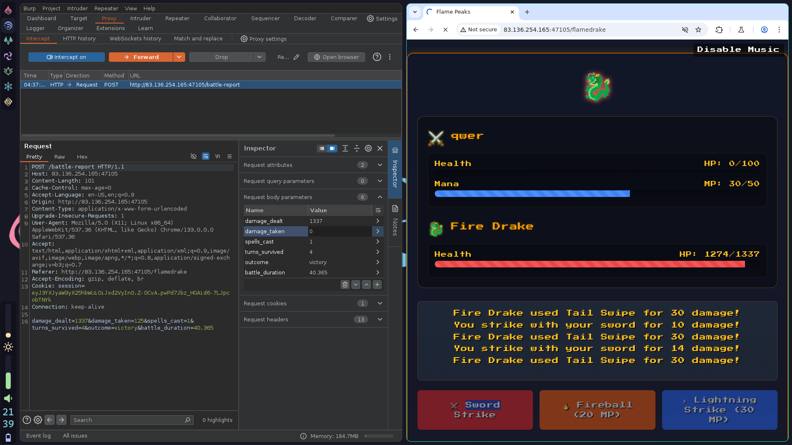
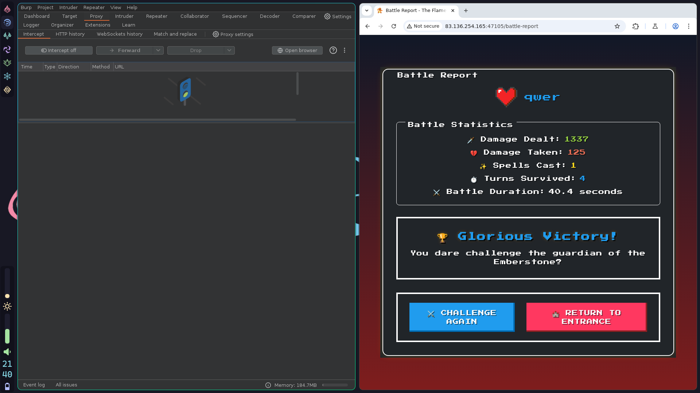

# Trial by Fire
> As you ascend the treacherous slopes of the Flame Peaks, the scorching heat and shifting volcanic terrain test your endurance with every step. Rivers of molten lava carve fiery paths through the mountains, illuminating the night with an eerie crimson glow. The air is thick with ash, and the distant rumble of the earth warns of the danger that lies ahead. At the heart of this infernal landscape, a colossal Fire Drake awaits—a guardian of flame and fury, determined to judge those who dare trespass. With eyes like embers and scales hardened by centuries of heat, the Fire Drake does not attack blindly. Instead, it weaves illusions of fear, manifesting your deepest doubts and past failures. To reach the Emberstone, the legendary artifact hidden beyond its lair, you must prove your resilience, defying both the drake’s scorching onslaught and the mental trials it conjures. Stand firm, outwit its trickery, and strike with precision—only those with unyielding courage and strategic mastery will endure the Trial by Fire and claim their place among the legends of Eldoria.

In this writeup, I will try my best not only to show a step-by-step solution, but also to show how I came up with a way to get a flag.
## Deploy the Docker image during the challenge
This challenge can be done either by launching the Docker instance online during the event or running the attached script as root. Ensure you have Docker installed before running the following script. On your browser, you should now be able to access it by going to `http://localhost:1337`.
```
$ sudo ./build-docker.sh
```
## The game
Without any hacks, go to the site. Type your name, enter the arena, tickle the dragon with your sword and pixie dust, then suffer constant defeat and humiliation as it blows fire and tailwhips you into oblivion. Repeat until you're sick of this and ready to hack this game.
## How I discovered the solution
### Initial attempts
This site had some interesting Easter eggs as well as hidden "Ancient Capture Device" button which is activated by pressing the `Up Arrow` key.
### File tree
Take a look at the folder containing the web application. In this writeup, all filepaths are relative to `web_trial_by_fire`.
```
$ tree web_trial_by_fire
web_trial_by_fire
├── build-docker.sh
├── challenge
│   ├── application
│   │   ├── app.py
│   │   ├── blueprints
│   │   │   └── routes.py
│   │   ├── config.py
│   │   ├── static
│   │   │   ├── css
│   │   │   │   ├── main.css
│   │   │   │   └── style.css
│   │   │   ├── images
│   │   │   │   ├── dragon.jpg
│   │   │   │   └── favicon.png
│   │   │   ├── js
│   │   │   │   ├── effects.js
│   │   │   │   └── game.js
│   │   │   └── music
│   │   │       ├── battle-theme.mp3
│   │   │       ├── capture.mp3
│   │   │       ├── death.mp3
│   │   │       ├── defeat.mp3
│   │   │       ├── dragon.mp3
│   │   │       ├── dragon-roar1.mp3
│   │   │       ├── dragon-roar2.mp3
│   │   │       ├── dragon-roar3.mp3
│   │   │       ├── fireball.mp3
│   │   │       ├── lightning.mp3
│   │   │       ├── sword-slash.mp3
│   │   │       └── victory.mp3
│   │   └── templates
│   │       ├── flamedrake.html
│   │       ├── index.html
│   │       └── intro.html
│   ├── flag.txt
│   ├── requirements.txt
│   ├── uwsgi.ini
│   └── wsgi.py
├── config
│   ├── nginx.conf
│   └── supervisord.conf
└── Dockerfile

11 directories, 32 files
```
Here, we notice that `flag.txt` is stored in the `challenge` directory.
### Dockerfile
Also, take a look at the Dockerfile:
```
$ cat Dockerfile

...
# Create application directory
RUN mkdir -p /app
WORKDIR /app

# Copy backend code and requirements from challenge/backend into /app/backend
COPY challenge  .
...

```
Notice that the app is running on an Alpine Linux container. This snippet from the `Dockerfile` shows that the whole `challenge` directory is copied over to `app`, which is like a "root" directory of the application. This means that if we somehow get a shell, we're already at the same directory as `flag.txt`. There are at least two ways (that I think of) to access this:
* Execute a command similar to `cat flag.txt`. There are lots of resources explaining client-side or server-side execution, maybe like `; cat flag.txt` or something similar.
* Get the game to render the flag by doing some arbitrary code execution, like [this](https://www.youtube.com/watch?v=OPcV9uIY5i4), but instead of perfectly executed jumps and glitches, I was thinking of dealing a certain amount of damage or somehow defeat the dragon by some integer overflow.
Since the game is supposed to be 'very easy', I think the first one applies here.
### `requirements.txt`
It also helps to see what dependencies our web app has. Looking up the version numbers on a search engine may give you CVEs that can be exploited.
```
$ cat challenge/requirements.txt
Flask==3.1.0
gunicorn==23.0.0
supervisor==4.2.5
Jinja2==3.1.5
werkzeug==3.1.3
MarkupSafe==3.0.2
```
I looked up version numbers of each dependencies and one thing stood out: `Jinja2`. This is a templating engine that makes it possible to evaluate Python code and display it in HTML, which is useful for displaying usernames and damage numbers. I looked up Jinja2 version 3.1.5 in the CVE database and found that it's vulnerable to a remote code execution attack according to CVE-2024-56201. There is a way to send data that's enclosed within `{{ }}` so it gets evaluated in the resulting HTML.

## Walkthrough
### Plan of attack
Here is what we know from the downloaded zip file.
* Looking at the local copy, we see that there is a `flag.txt` stored in the application's directory. There is no mention of `flag.txt` in the Python files; it's just stored as a file within the deployed container.
* According to the Dockerfile, we are using an Alpine Linux image.
* The exploit used to get to this flag is based on a vulnerability in `Jinja2==3.1.5`, found in `requirements.txt` where an attacker can launch remote code execution (RCE). More info can be found [here](https://vulert.com/vuln-db/CVE-2024-56201).
Knowing this, we should be able to send a `POST` request containing code equivalent to `cat flag.txt`. In this walkthrough, we send a formatted `POST` request containing Python code within a Jinja2 template expression to display the contents of `flag.txt`. In other words, `{{ python_function_display('flag.txt') }}`
## Exploit
* Start by running BurpSuite in Proxy mode.
* Launch its internal browser, then deploy the site. Enable Intercept so you have a chance of modifying your `POST` request before going through.
* You have two chances to intercept `POST` requests: before the battle where you can modify the user name and after the battle where you can modify damage taken, damage dealt, etc.
* Here's an example of me modifying the post-battle `POST` request, making it look like I won the battle.





* Here is a screenshot of me successfully injecting `{{ url_for.__globals__ }}` in one of the parameters.


* Do it yourself: modify one of the parameters with `{{request.application.__globals__.__builtins__.__import__('os').popen('cat flag.txt').read()}}`. You should end up with something similarto this screenshot. Read more about this injected snippet [in this proof of concept](https://www.onsecurity.io/blog/server-side-template-injection-with-jinja2).


## Final thoughts

> "I lost the battle, but won the war." - *Jerry Arciaga, after spending hours for this one flag*

After solving the CTF, I realized that the hints were actually pointing to this vulnerability! In the `challenge/application/templates/index.html`, this snippet contained a Jinja2 template evaluated expression:

```html
<p class="nes-text">
      In a land of burning rivers and searing heat, the Fire Drake stands guard over the Emberstone. Many have sought its power; none have prevailed.
      <br><br>
      Legends speak of ancient template scrolls—arcane writings that twist fate when exploited. Hidden symbols may change everything.
      <br><br>
      Can you read the runes? Perhaps {{ 7 * 7 }} is the key.
</p>
```

The expression in the last line before the closing tag, `{{ 7 * 7 }}` evaluates to `49` in the rendered HTML. Had I realized this earlier, I would have saved a lot of time instead of blindly throwing scripts and SQL injections. When approaching web application challenges, it definitely helps to spend some time to look into their code.
